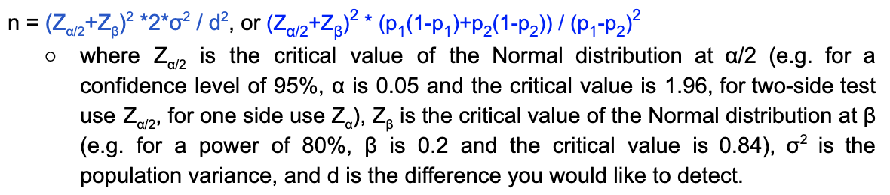
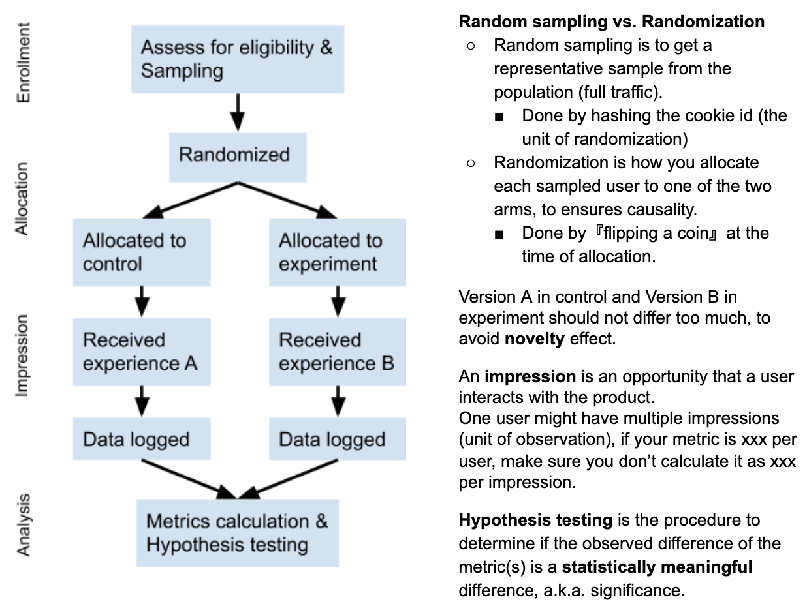
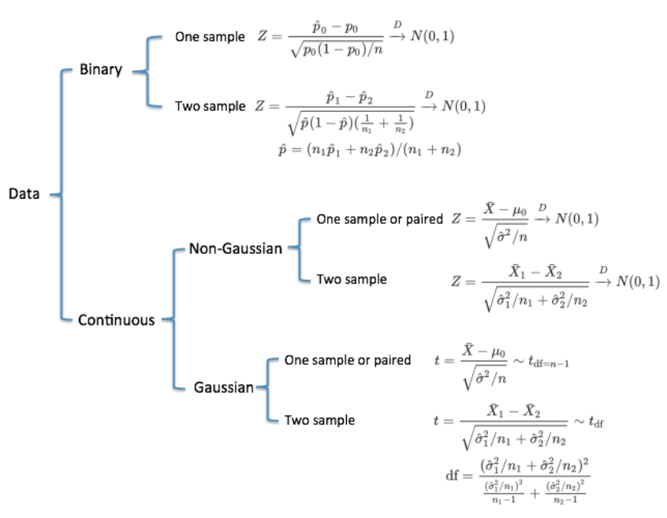
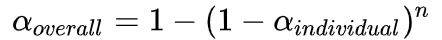
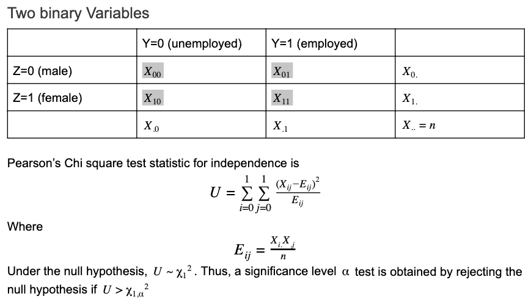
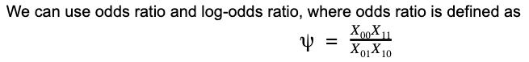

<https://yjiang30.wordpress.com/2020/05/24/3/>

## Outline : Brief

-------------------

- The scenario A/B testing works:
  - Have a new version of this feature, ready to launch and make comparison
- The scenario of A/B testing doesn’t work
  - Want to propose to build this feature, should do an opportunity sizing analysis
    - analyze user log
    - survey
    - focus group
    - UER(user experience research)
  - A new feature and no comparison
    - Check the feature adoption rate
    - Check the feature’s retention rate
    - Any negative effect
  
- A/B testing Steps:
  - Objective define
  - Be clear about what this feature is
  - Define the metric
  - Experiment design and setup: control cost/risk, ensure the effectiveness of experiment
  - Conduct Hypothesis testing
  - Result interpretation
- key assumption:
  - Units are assigned randomly
  - Unites are independent

\
&nbsp;

## 1. Define Goal: Define what means ‘better'

-------------------

- Based on different stages of product lifecycle (AARRR):
  - Aquisition
    - More new user
  - Activation
    - High engagement
  - Retention
    - High Retention
    - Low churn
    - High engagement
  - Revenue
    - Revenue growth
  - Referral
    - More new user for this channel
- Long Term / Short term
- Better User Experience
- Sustainable

\
&nbsp;

- Business Question
  - User Growth
    - Analyze new user trends
    - How to acquire new users
  - Engagement
    - How to measure user engagement
      - MAU / WAU / DAU
      - Time Spent
      - Actions
    - Analyze product usage trends
    - Retention Curve
  - Revenue Growth
    - Conversions
      - How to convert more users to pay
      - Price strategy, discount, etc
    - Subscription renewal
      - Recurring payment vs non-recurring payment
      - User cancel vs payment issue
    - LTV( lifetime Value)
      - Does LTV justify the cost of acquiring customers

\
&nbsp;

## 2. Define Metric: Based on business goal

-------------------

- Metrics category:
  - Direct metrics(directly measure, easily to test) / compound metrics(combine different metrics, defined difficultly but more comprehensive)
  - High-level / low-level: aggregate degree
  - Primary metrics / secondary metrics: the impact on decision making
- Metrics evaluation:
  - Robustness: if it can capture the difference between two version
  - sensitiveness: if it is influenced by other unrelated factor? If it is sensitive to the factor we want to test
  - Use a/a test to evaluate if it’s a good metrics
  - If metrics’ distribution close to normal distribution, use mean/median, otherwise use 25 % or 75 %
- Two main use of metrics:
  - User for Invariant checking
    - Shouldn’t change across your experiment and your control
      - Are the population is the same? The number is the same? The distribution is the same?
  - User for evaluations
    - High-level business metrics
    - Detail: user experience
- Benchmark your metrics(know what's the baseline values, estimate the standard deviation, ):
  - companies that collect the data
  - companies that conduct surveys
  - academic papers
  - User Experience Research
  - Focus Group
  - Surveys conducted within the company

```
    def cal_sd(conversion,d_min,denominator):
        '''
        Conversion:转化率名称
        d_min:最小变化
        denominator:转化率的分母
        '''
        R = {}
        R['d_min'] = d_min #最小变化
        R['p'] = baseline[conversion]
        R['n'] = baseline[denominator]
        R['sd'] = round(mt.sqrt((R["p"]*(1-R["p"]))/R["n"]),4)
        print('{} 标准差:'.format(conversion),R['sd'])
```

\
&nbsp;

## 3. Experiment Design (Randomized Experiment)

-------------------

- Experiment group / Control Group
  - How to divide experiment/control group?
    - user_id: used more often. Can track users’ changes
    - cookie_id: UI design, or if no login process(or device_id)
    - Event: useful when user can not perceive the change
  - Factor to choose the control/experiment group
    - Coherence of experience
    - Ethical risk: collect users’ information
    - Variability of metrics
    - 从过去一个月report 过post 里面的人选，they are more sensitive
    - Oversample / undersample to balance
    - find users in different location in order to remove or decrease the influence caused by network effect
    - Check the difference of difference to remove the time’s influence
  - If users are assigned to both test and control group: delete them to ensure units are independent
  - Network effect:
    - User a and b are not independent
    - Solution: clustering groups with connections, split these clusters into two parallel experiment, control group and experi
    - ment group in two markets/districts

- Sample Size Calculation (From business perspective, consider the timeframe)： Alpha,beta, baseline rate, minimum detectable effect
  

  - significance level(Alpha): significance level
  - statistical power(1-Beta): beta = type ii error. Under h1, h0 is not rejected
  - when ab test has the actual difference,  the probability that we are able to detect
  - Baseline rate: in this case, is the history click through rate. The baseline we want to compare
  - Minimum detectable effect: evaluates our requirements on precision to this experiment . How many difference we want to detect.

    ```
    def get_sds(p,d):
        sd1=mt.sqrt(2*p*(1-p))
        sd2=mt.sqrt(p*(1-p)+(p+d)*(1-(p+d)))
        x=[sd1,sd2]
        return x

    #计算z-score
    def get_z_score(alpha):
        return norm.ppf(alpha)

    #计算样本量
    def get_sampSize(sds,alpha,beta,d):
        n=pow((get_z_score(1-alpha/2)*sds[0]+get_z_score(1-beta)*sds[1]),2)/pow(d,2)
        return n
    ```

  - How to reduce sample size?
    - Concentrate the traffic in certain subset
    - You can increase significance level alpha, or reduce power (1-beta) which means increase beta, or change the unit of diversion if originally it is not the same with unit of analysis (unit of analysis: denominator of your evaluation metric).

- A/A test(normally run 3 days before laughing a/b testing):
  - also can be used to evaluate the metrics effectiveness
  - Evaluate if our sampling method if correct or not
- Holdout group:
  - Keep 5 % of users and don’t implement the new feature to observe the long-term effect
- Expriment time & exposure time
  - How to decide how long to run?
    - Normally one week to two week
    - Check if there’s any festival or weekend, increase experiment time so we can observe users data from different time
    - Check user behaivor, should be a complete business cycle
    - Check the daily traffic
  - What do you do if your experiment take too long to run?
    - Increase exposure
    - Reduce the variance of blocking, run experiment within sub-groups
- Randomization makes the allocation independent of the potential outcome and experiment group and control group have the same distribution, thus we can compare the mean difference, and it can be only attributed to the treatment

- Novelty effect: extra and short term reaction
  - 新鲜感/陌生感
  - add noise and bias
  - solution：run test long-term / choose new users
- How to deal with the situation when we cannot do randomization
  - Reason: Confounding: two or more factors are different in two groups
  - Method 1 - Matching: sampling the experiment group from the population first, and find a matched user from the rest of the population and put them into the control group (happen when doing randomization)
    - Types:
      - Individual Matching: one to one match on selected factors
      - Frequency Matching: set-to-set match on the frequency of selected factors, observe the selected factors’ distribution or frequency first and seek for the same distribution set from the rest of the pool
      - propensity score matching: one on one matching based on estimated propensity score
    - Caveat:
      - Exact match is hard to find
      - Might make your control group selection biased
      - Cannot study the effect of the matched factor
  - Method2 - Segmentation: Divide the users into subsets and calculate the metric per segment, then combine all the metrics together, typically by weighted average (happen after randomization)
    - Purposes:
      - When suspecting your randomization is not perfect, segment-then-unify is an alternative to matching
      - When suspecting the effect may vary across different subsets of users, segmentation helps you verify such heterogeneity
  - Method3 - Holdout Group (For long-term)
    - A small group of users whom you don’t expose to new experience to understand longer-term impact
    - Exclude the holdout group from all improved experiences to understand additive impact from multiple changes
  - Method4 - Double Control Group(AAB test)
    - Two control groups have the same treatment, if there are significant difference there the randomization might be biased
    - To detect any potential bias in your sampling
    - Solution:
      - Check your code
      - Consider the segment analysis / matching

\
&nbsp;

## 4. Hypothesis Testing(Only for a/b testing, metric should be defined as average: CTR/DAU/ARPU)

-------------------

- Before conclusion
  - Check if we filter users as same criteria
  - Check the condition we grab the data is consistent
  - Sanity Check
    - Why?
      - The setting of experiment diversion is not correct and experiment and control aren’t comparable
      - Set up the filter differently in the experiment and the control
      - Data capture didn’t actually capture the events that you want to look for
    - How?
      - Use invariant variable to track if there’s some difference throughout the experiment
        - The population sizing metrics based on the unit of diversion
        - Invariant vitiable shouldn’t change when you run experiment
- Hypothesis:
  - H0 is the hypothesis you want to subvert, H1 is the hypothesis you want to prove
  - Is a better than b?  h1:a-b>0
  - Can you tell me if there is a difference? H0: a - b = 0
  - Which one is better? Ask if we can set as two-side
- P-value: under the null hypothesis, the probability of obtaining as or more extreme results than the current observation
- T test:  if the difference between mean of two sample is statistically difference so that we are able to say two population is also different.
- Significance level: the probability of rejecting H0, when H0 is true
- Confidence interval: refers to the percentage of all possible samples that can be expected to include the true population parameter
- Error:
  - Type 1 Error: This happens when H0 is true but is rejected, significance level = type I error rate = probability of type I error
  - Type 2 Error(beta): This happens when H1 is true but h0 is not rejected, type 2 error rate = 1- probability of type I error
  - Power: the probability of rejecting H0 when h1 is true. Power = 1- beta
  - Tradeoff: convicting an innocent man(Type i ) vs realeasing a criminal (type ii). Type I error is associated with a larger risk than type ii error is.
- Sign test: confirm the result with sign test. The number of success out of total trial is statistically significant.
- Hypothesis Testing Formula (Applicable for mean/average: CTR /DAU/ ARPU)
    
- Data highly skewed or statistics is hard approximate with CLT?
  - Bootstrap, storage computational expensive
- unit of diversion vs unit of analysis
- how to reduce sample size
- power analysis
- sampling method - algorithm? hashing / resourvior sampling

\
&nbsp;

## 5. Result Interpretation

-------------------

- If we cannot reject H0, we don’t have sufficient evidence to make conclusive statement.
  - Collect more data, run longer experience
  - Improve the metric estimation
  - If only one metric is different
    - Segment Analysis: based on different platform, different time period
    - Cross Validation:
  - If more metrics are different
    - Use the higher confidence level
      - If each metric are independent with each other: make
        
  - if there are lots of metrics or multiple test groups: Multivariate experiment will increase the type I error
    - Beferroni correction: divide the significance level 0.05 by the number of tests in the multiple testing
    - FDR adjustments: rank p-value of m test from low to high
- If the metrics goes down when our expectation is up?
  - Check is there any external reason
    - Time period: if the time is long enough, is there any festival/event
    - Technical problem
  - Compare with other metrics, if their direction is different with us?
    - If yes, check if our metric design is correct or not
    - If no, check other factors
  - Check our control group/experiment group is correct or not
    - Do a segmentation, understand what factor will influence users
  - Long term effect
- What if the hypothesis is rejected? Can we directly deploy the new feature?
  - Slowly Ramp up (maybe have long-term effect, seasonal effect)
  - Make clear about Difference between treatment and control
  - Make clear about Difference between launch and before-launch
  - Pay attention to ramp up plan and use of the hold-out group
  - consider the costs: human labor costs/ risk of bugs
  - List negative effect: from user experience, is there any cost, for part of users present positive but other part negative
  - Ask other team if they are testing other features
- Simpson paradox
  
  Though the trends appear in all groups, after we combine the groups the trends disappear
  - why happen?
    - The traffic source volume is called a “lurking” variable or confounding variable. It is unevenly distributed between the experiences and is in fact responsible for the observed results.
    - how to avoid it?
      - make sure the samples are completely randomized and free from bias
- Sign test
  - observe if everyday's changes are significant or not. count the cases that metrics in control group is smaller than experiment group
- What if we have conflicting metrics result?
  - If we meet expectation: ready to launch it.
  - According to business context(long-term or short-term goal, revenue)
  - Be cautious if result is too good, may need to investigate

- How to determine if it is independent? Union probability
    
- Check any confounders:
  - The results are replicated in many studies
  - Each of the studies controlled for plausible confounding variables
  - There is a plausible scientific explanation for the existence of a casual relationship

- How to estimate the strength of dependence
    
- Two continuous variables: look at their correlation, if and only if two variables are normally distributed
- One continuous variables and one discrete: make KS test

\
&nbsp;

## 6. Roll out plan

-------------------
    90- 10. Starting with a small portion of their total audience and slowly increasing the sample size to a higher percentage of the audience until finally reaching 100 %

\
&nbsp;

## 10. Policy and Ethics

-------------------

- Are users being informed?
- What users identifiers are tied to the data?
- What type of data is being collected? Health/financial data
- What is the level of confidentiality and security?

A terms of services or privacy policy

- Minimize participant risk
- Have clear benefits for risk taken
- Provide informed consent
- Handle sensitive data appropriately
